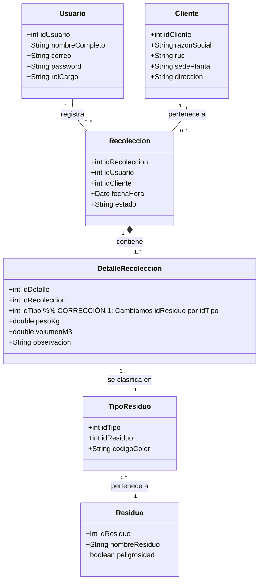

# Diseño Arquitectónico y Código Base - ECOLIM S.A.C. (Actualizado)

**Rol:** Arquitecto de Software Senior y Tech Lead
**Proyecto:** App Móvil de Digitalización de Recolección de Residuos (ECOLIM S.A.C.)
**Enfoque:** Alta escalabilidad, offline-first, arquitectura MVVM nativa en Java.

---

## 1. Diagrama de Clases UML del Sistema (Actualizado con correcciones)

De acuerdo con el Diagrama Entidad-Relación actualizado (corrección del profesor), se ha modificado la estructura de los Residuos. Ahora la entidad principal es `Residuo`, y `Tipo_Residuo` depende de ella. Además, el `DetalleRecoleccion` apunta directamente a `Residuo`.



---

## 2. Arquitectura de Carpetas (Android Studio - MVVM)

Se ha añadido la estructura para manejar el **Login** (Autenticación), que interactuará con la tabla `Usuario`.

```text
com.ecolim.app
│
├── api/                  # Capa de red (Retrofit, OkHttp) para sincronización con API RESTful
│   ├── ApiClient.java
│   └── EcolimApiService.java
│
├── data/                 # Capa de datos y repositorios (Patrón Offline-First)
│   ├── database/         # Configuración SQLite local
│   │   ├── DatabaseHelper.java
│   │   └── dao/          # Data Access Objects para queries separadas
│   └── repository/       # Repositorios que deciden si obtener datos de BD local o API
│       ├── AuthRepository.java  # Repositorio para manejar el Login
│       └── RecoleccionRepository.java
│
├── models/               # Clases POJO / Entidades (Mapeo de la BD)
│   ├── Usuario.java
│   ├── Cliente.java
│   ├── Recoleccion.java
│   ├── DetalleRecoleccion.java
│   ├── Residuo.java
│   └── TipoResiduo.java
│
├── ui/                   # Interfaz de Usuario (Activities y Fragments)
│   ├── login/            # Módulo de Autenticación
│   │   ├── LoginActivity.java
│   │   └── LoginViewModel.java
│   ├── home/             # Dashboard principal
│   │   ├── HomeFragment.java
│   │   └── HomeViewModel.java
│   ├── scanner/          # Escáner IA / Selección manual
│   │   ├── ScannerFragment.java
│   │   └── ScannerViewModel.java
│   ├── results/          # Pantalla de confirmación ("¡Bien separado!")
│   │   ├── ResultsActivity.java
│   │   └── ResultsViewModel.java
│   └── map/              # Integración con Google Maps API
│       ├── MapFragment.java
│       └── MapViewModel.java
│
└── utils/                # Utilidades, constantes y helpers
    ├── Constants.java
    ├── SessionManager.java # Manejo de sesión del usuario logueado (SharedPreferences)
    └── DateUtils.java
```

---

## 3. Modelo de Base de Datos Local (SQLite - Scripts DDL)

Scripts DDL actualizados. La base de datos ya soporta el módulo de **Login**, dado que la tabla `Usuario` incluye los campos `Correo` y `Password`. Esto permite validar credenciales localmente si el dispositivo está offline, o enviar la petición a la API.

```sql
-- 1. Tabla Usuario (Soporta el Login)
CREATE TABLE Usuario (
    idUsuario INTEGER PRIMARY KEY AUTOINCREMENT,
    nombre_Completo TEXT NOT NULL,
    Correo TEXT NOT NULL UNIQUE,
    Password TEXT NOT NULL,
    rol_Cargo TEXT NOT NULL
);

-- 2. Tabla Cliente
CREATE TABLE Cliente (
    id_Cliente INTEGER PRIMARY KEY AUTOINCREMENT,
    Razon_Social TEXT NOT NULL,
    ruc TEXT NOT NULL UNIQUE,
    Sede_Planta TEXT,
    direccion TEXT
);

-- 3. Tabla Residuo (Reemplaza a Categoria_Res)
CREATE TABLE Residuo (
    id_residuo INTEGER PRIMARY KEY AUTOINCREMENT,
    nombre_residuo TEXT NOT NULL,
    peligrosidad INTEGER NOT NULL CHECK (peligrosidad IN (0, 1)) -- 0: No, 1: Sí
);

-- 4. Tabla Tipo_Residuo (Ahora depende de Residuo)
CREATE TABLE Tipo_Residuo (
    id_tipo INTEGER PRIMARY KEY AUTOINCREMENT,
    id_residuo INTEGER NOT NULL,
    Codigo_Color TEXT NOT NULL,
    FOREIGN KEY(id_residuo) REFERENCES Residuo(id_residuo) ON DELETE CASCADE
);

-- 5. Tabla Recolección (Cabecera)
CREATE TABLE Recoleccion (
    id_recoleccion INTEGER PRIMARY KEY AUTOINCREMENT,
    id_Usuario INTEGER NOT NULL,
    id_Cliente INTEGER NOT NULL,
    Fecha_Hora DATETIME DEFAULT CURRENT_TIMESTAMP,
    Estado TEXT NOT NULL, -- Ej: 'PENDIENTE', 'SINCRONIZADO'
    FOREIGN KEY(id_Usuario) REFERENCES Usuario(idUsuario) ON DELETE RESTRICT,
    FOREIGN KEY(id_Cliente) REFERENCES Cliente(id_Cliente) ON DELETE RESTRICT
);

-- 6. Tabla Detalle de Recolección (Ahora enlaza con Residuo)
CREATE TABLE Detalle_recoleccion (
    id_detalle INTEGER PRIMARY KEY AUTOINCREMENT,
    id_recoleccion INTEGER NOT NULL,
    id_residuo INTEGER NOT NULL,
    Peso_kg REAL NOT NULL,
    volumen_m3 REAL NOT NULL,
    observacion TEXT,
    FOREIGN KEY(id_recoleccion) REFERENCES Recoleccion(id_recoleccion) ON DELETE CASCADE,
    FOREIGN KEY(id_residuo) REFERENCES Residuo(id_residuo) ON DELETE RESTRICT
);
```

---

## 4. Código Java (Snippet Core Actualizado)

### A. `DatabaseHelper.java`

Actualizado para reflejar la nueva estructura y la validación para el Login.

```java
package com.ecolim.app.data.database;

import android.content.Context;
import android.database.Cursor;
import android.database.sqlite.SQLiteDatabase;
import android.database.sqlite.SQLiteOpenHelper;
import com.ecolim.app.models.Usuario;

public class DatabaseHelper extends SQLiteOpenHelper {

    private static final String DATABASE_NAME = "ecolim_db.db";
    private static final int DATABASE_VERSION = 2; // Versión incrementada por cambios

    public DatabaseHelper(Context context) {
        super(context, DATABASE_NAME, null, DATABASE_VERSION);
    }

    @Override
    public void onConfigure(SQLiteDatabase db) {
        super.onConfigure(db);
        db.setForeignKeyConstraintsEnabled(true);
    }

    @Override
    public void onCreate(SQLiteDatabase db) {
        db.execSQL("CREATE TABLE Usuario (idUsuario INTEGER PRIMARY KEY AUTOINCREMENT, nombre_Completo TEXT NOT NULL, Correo TEXT NOT NULL UNIQUE, Password TEXT NOT NULL, rol_Cargo TEXT NOT NULL);");
        db.execSQL("CREATE TABLE Cliente (id_Cliente INTEGER PRIMARY KEY AUTOINCREMENT, Razon_Social TEXT NOT NULL, ruc TEXT NOT NULL UNIQUE, Sede_Planta TEXT, direccion TEXT);");
        db.execSQL("CREATE TABLE Residuo (id_residuo INTEGER PRIMARY KEY AUTOINCREMENT, nombre_residuo TEXT NOT NULL, peligrosidad INTEGER NOT NULL CHECK (peligrosidad IN (0, 1)));");
        db.execSQL("CREATE TABLE Tipo_Residuo (id_tipo INTEGER PRIMARY KEY AUTOINCREMENT, id_residuo INTEGER NOT NULL, Codigo_Color TEXT NOT NULL, FOREIGN KEY(id_residuo) REFERENCES Residuo(id_residuo) ON DELETE CASCADE);");
        db.execSQL("CREATE TABLE Recoleccion (id_recoleccion INTEGER PRIMARY KEY AUTOINCREMENT, id_Usuario INTEGER NOT NULL, id_Cliente INTEGER NOT NULL, Fecha_Hora DATETIME DEFAULT CURRENT_TIMESTAMP, Estado TEXT NOT NULL, FOREIGN KEY(id_Usuario) REFERENCES Usuario(idUsuario) ON DELETE RESTRICT, FOREIGN KEY(id_Cliente) REFERENCES Cliente(id_Cliente) ON DELETE RESTRICT);");
        db.execSQL("CREATE TABLE Detalle_recoleccion (id_detalle INTEGER PRIMARY KEY AUTOINCREMENT, id_recoleccion INTEGER NOT NULL, id_residuo INTEGER NOT NULL, Peso_kg REAL NOT NULL, volumen_m3 REAL NOT NULL, observacion TEXT, FOREIGN KEY(id_recoleccion) REFERENCES Recoleccion(id_recoleccion) ON DELETE CASCADE, FOREIGN KEY(id_residuo) REFERENCES Residuo(id_residuo) ON DELETE RESTRICT);");
    }

    @Override
    public void onUpgrade(SQLiteDatabase db, int oldVersion, int newVersion) {
        db.execSQL("DROP TABLE IF EXISTS Detalle_recoleccion");
        db.execSQL("DROP TABLE IF EXISTS Recoleccion");
        db.execSQL("DROP TABLE IF EXISTS Tipo_Residuo");
        db.execSQL("DROP TABLE IF EXISTS Residuo");
        db.execSQL("DROP TABLE IF EXISTS Cliente");
        db.execSQL("DROP TABLE IF EXISTS Usuario");
        onCreate(db);
    }

    // Método para validar el Login en modo Offline
    public Usuario login(String correo, String password) {
        SQLiteDatabase db = this.getReadableDatabase();
        Cursor cursor = db.rawQuery("SELECT idUsuario, nombre_Completo, rol_Cargo FROM Usuario WHERE Correo = ? AND Password = ?", new String[]{correo, password});

        if (cursor != null && cursor.moveToFirst()) {
            Usuario user = new Usuario();
            user.setIdUsuario(cursor.getInt(0));
            user.setNombreCompleto(cursor.getString(1));
            user.setCorreo(correo);
            user.setRolCargo(cursor.getString(2));
            cursor.close();
            return user;
        }
        if (cursor != null) cursor.close();
        return null; // Login fallido
    }
}
```

### B. `Residuo.java` (Nuevo Modelo Principal)

```java
package com.ecolim.app.models;

public class Residuo {
    private int idResiduo;
    private String nombreResiduo;
    private boolean peligrosidad;

    public Residuo() { }

    public Residuo(int idResiduo, String nombreResiduo, boolean peligrosidad) {
        this.idResiduo = idResiduo;
        this.nombreResiduo = nombreResiduo;
        this.peligrosidad = peligrosidad;
    }

    public int getIdResiduo() { return idResiduo; }
    public void setIdResiduo(int idResiduo) { this.idResiduo = idResiduo; }

    public String getNombreResiduo() { return nombreResiduo; }
    public void setNombreResiduo(String nombreResiduo) { this.nombreResiduo = nombreResiduo; }

    public boolean isPeligrosidad() { return peligrosidad; }
    public void setPeligrosidad(boolean peligrosidad) { this.peligrosidad = peligrosidad; }
}
```

---

## 5. Lógica de Reportes (Query SQL Compleja Actualizada)

La consulta se ha ajustado para usar la nueva tabla `Residuo` en lugar de `Categoria_Res`.

```sql
SELECT
    DATE(r.Fecha_Hora) AS Fecha,
    c.Razon_Social AS Cliente,
    res.nombre_residuo AS Tipo_De_Residuo,
    SUM(d.volumen_m3) AS Volumen_Total_m3,
    SUM(d.Peso_kg) AS Peso_Total_kg
FROM
    Recoleccion r
INNER JOIN
    Cliente c ON r.id_Cliente = c.id_Cliente
INNER JOIN
    Detalle_recoleccion d ON r.id_recoleccion = d.id_recoleccion
INNER JOIN
    Residuo res ON d.id_residuo = res.id_residuo
GROUP BY
    DATE(r.Fecha_Hora),
    c.id_Cliente,
    res.id_residuo
ORDER BY
    Fecha DESC,
    c.Razon_Social ASC;
```
